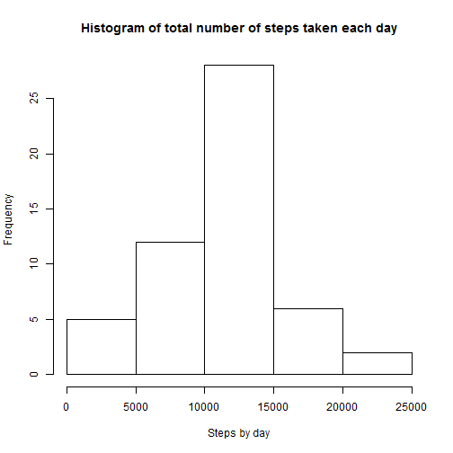
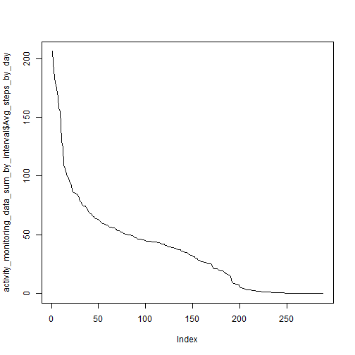
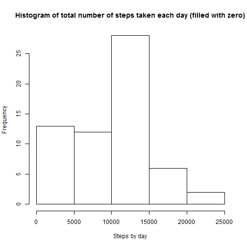
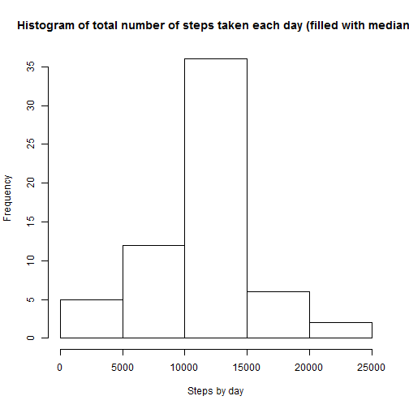
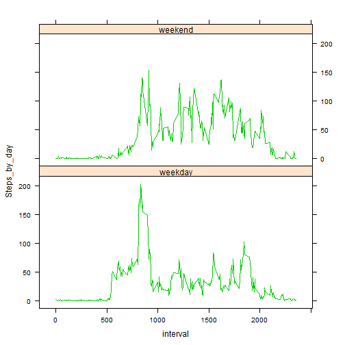
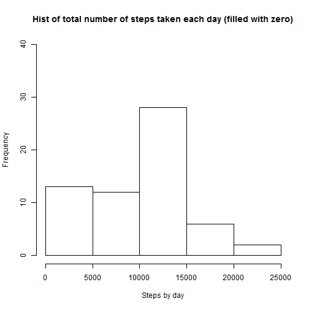
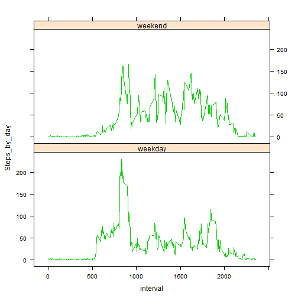

## Loading and preprocessing the data

Firstly we will load the data from the repository and prepare the data into a format suitable for analysis.

```r
setwd("C:/Users/steven-j.yu/Downloads/Steven's/Studying/Data Science - 05 Reproducible Research/Peer assignment 1/RepData_PeerAssessment1")
activity_monitoring_data <- read.csv("activity.csv",na.strings="NA")
```

And then the date coloume will be transferred into date format so as to be easier to fit analysis on.  
Also, the original data will be split into two parts: one with na data only and one without na data.

```r
activity_monitoring_data$date <- as.Date(activity_monitoring_data$date,"%Y-%m-%d")
activity_monitoring_data_nas <- subset(activity_monitoring_data,is.na(activity_monitoring_data$steps))
activity_monitoring_data_no_nas <- activity_monitoring_data[apply(activity_monitoring_data, 1, function(x)!any(is.na(x))), , drop=F] 
```


## What is mean total number of steps taken per day?

After adjusting the raw data, we will firstly calculate the total number of steps taken per day and make a histogram.  
Mean and median of total number of steps per day will be calculated at the same time.
 


The mean of total number of steps per day is 1.0766189 &times; 10<sup>4</sup>;   
The median of total number of steps per day is 1.0765 &times; 10<sup>4</sup>.

## What is the average daily activity pattern?

The average daily activity pattern could be figured out through following plot:
 


## Imputing missing values

Firstly we will calculate the total number of missing values in the dataset.


The number is 2304.

Then we will introduce three methods to fill in the missing values: fill with zero, with mean and with median.
If fill the missing values with zero, the hist would be:  
 

If fill the missing values with mean, the hist would be:  
 

If fill the missing values with median, the hist would be:  
 

Through these three hist, we would find if filled with zeros, there will be a great increase in the first batch (which is mainly contributed by zeros), while if filled with mean or median, the overall figure will not change greatly.

## Are there differences in activity patterns between weekdays and weekends?

We will create a new factor variable in the dataset with two levels ¨C ¡°weekday¡± and ¡°weekend¡± indicating whether a given date is a weekday or weekend day for three filling methods respectively.

For replacement with zero, the plot would be:

 


For replacement with mean, the plot would be:

 


For replacement with median, the plot would be:

 
