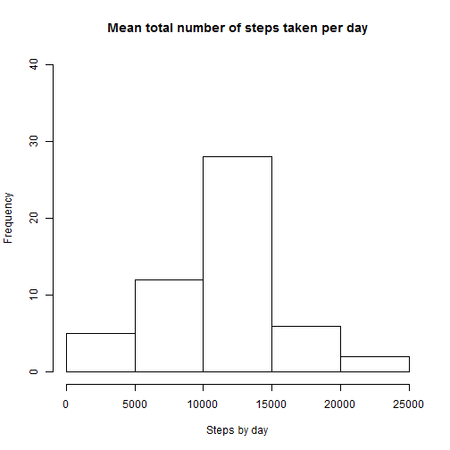
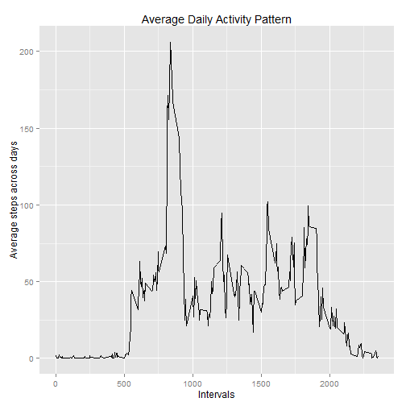
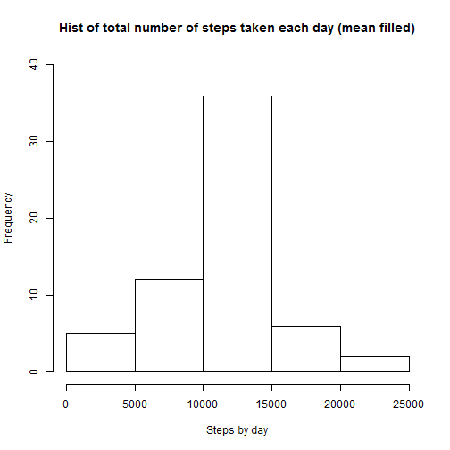
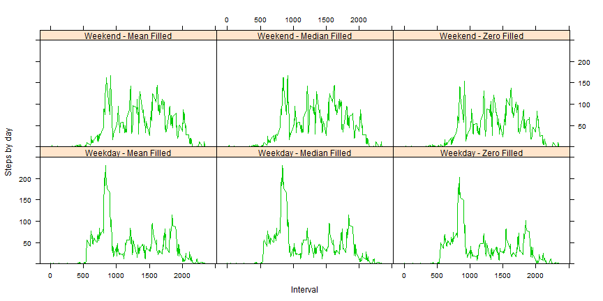

## Loading and preprocessing the data

Firstly we will load the data from the repository and prepare the data into a format suitable for analysis.

```r
Sys.getlocale(category = "LC_ALL")
```

```
## [1] "LC_COLLATE=English_United States.1252;LC_CTYPE=English_United States.1252;LC_MONETARY=English_United States.1252;LC_NUMERIC=C;LC_TIME=English_United States.1252"
```

```r
activity_monitoring_data <- read.csv("activity.csv",na.strings="NA")
```

And then the date coloume will be transferred into date format so as to be easier to fit analysis on.  
Also, the original data will be split into two parts: one with na data only and one without na data.

```r
activity_monitoring_data$date <- as.Date(activity_monitoring_data$date,"%Y-%m-%d")
activity_monitoring_data_nas <- subset(activity_monitoring_data,is.na(activity_monitoring_data$steps))
activity_monitoring_data_no_nas <- activity_monitoring_data[apply(activity_monitoring_data, 1, function(x)!any(is.na(x))), , drop=F] 
```


## What is mean total number of steps taken per day?

After adjusting the raw data, we will firstly calculate the total number of steps taken per day and make a histogram.  
Mean and median of total number of steps per day will be calculated at the same time.

### Calculate the total number of steps taken per day  

```r
library("sqldf")
activity_monitoring_data_sum_by_day <-sqldf("select sum(steps) as Steps_by_day,date from activity_monitoring_data group by date")
activity_monitoring_data_mean_by_day <-sqldf("select avg(steps) as Steps_by_day,date from activity_monitoring_data_no_nas group by date")
```

### Make a histogram of the total number of steps taken each day  

```r
hist(as.numeric(activity_monitoring_data_sum_by_day$Steps_by_day), xlab = "Steps by day", main = "Mean total number of steps taken per day",ylim=range(c(0:40)))
```

 

### Calculate and report the mean and median of the total number of steps taken per day

```r
mean_of_total_no_of_steps_per_day <-mean(as.numeric(activity_monitoring_data_sum_by_day$Steps_by_day),na.rm=TRUE)
median_of_total_no_of_steps_per_day <-median(as.numeric(activity_monitoring_data_sum_by_day$Steps_by_day),na.rm=TRUE)
```

The mean of total number of steps per day is 1.0766189 &times; 10<sup>4</sup>;   
The median of total number of steps per day is 1.0765 &times; 10<sup>4</sup>.
    
      
## What is the average daily activity pattern?
  
The average daily activity pattern could be figured out through following plot:  

```r
activity_monitoring_data_avg_by_interval <-sqldf("select avg(steps) as Avg_steps_by_day,interval from activity_monitoring_data group by interval order by Avg_steps_by_day DESC")
library(ggplot2)
qplot(interval,Avg_steps_by_day,data=activity_monitoring_data_avg_by_interval,geom="line",main="Average Daily Activity Pattern",ylab="Average steps across days",xlab="Intervals")
```

 

The interval contains the maximum number of steps is the first row of the result data processed:

```r
interval_contains_max_no_of_steps <- activity_monitoring_data_avg_by_interval[1,2]
```
The interval 835 contains the maximum number of steps.
    
      
## Imputing missing values

Firstly we will calculate the total number of missing values in the dataset.

```r
count_of_nas <- nrow(activity_monitoring_data_nas)
```

The number is 2304.

Then we will introduce three methods to fill in the missing values: fill with zero, mean and median.  
    
### Procedure of filling the missing values with zero
  
1.Filter nas and fill nas with zero  

```r
activity_monitoring_data_nas <- subset(activity_monitoring_data,is.na(activity_monitoring_data$steps))
activity_monitoring_data_nas[is.na(activity_monitoring_data_nas)] <- 0
```
  
2.Combine filled data with data with no nas and calculate sum by day  

```r
activity_monitoring_data_replace_with_zero <- rbind(activity_monitoring_data_nas, activity_monitoring_data_no_nas)
activity_monitoring_data_replace_with_zero_sum_by_day <-sqldf("select sum(steps) as Steps_by_day,date from activity_monitoring_data_replace_with_zero group by date")
```
  
3.Make hist   

```r
hist(as.numeric(activity_monitoring_data_replace_with_zero_sum_by_day$Steps_by_day),xlab = "Steps by day", main = "Hist of total number of steps taken each day (filled with zero)",ylim=range(c(0:40)))
```

 
    
### Procedure of filling the missing values with mean 
  
1.Filter nas and fill nas with mean    

```r
activity_monitoring_data_nas <- subset(activity_monitoring_data,is.na(activity_monitoring_data$steps))
activity_monitoring_data_mean_by_interval <-sqldf("select avg(steps) as steps,interval from activity_monitoring_data group by interval")
activity_monitoring_data_nas_combined_with_mean_by_interval <- sqldf("select * from activity_monitoring_data_nas d left join activity_monitoring_data_mean_by_interval m on d.interval=m.interval")
```
  
2.Combine filled data and calculate sum by day  

```r
activity_monitoring_data_replace_with_interval_mean <- rbind(activity_monitoring_data_nas_combined_with_mean_by_interval[,c(4,2,3)], activity_monitoring_data_no_nas)
activity_monitoring_data_replace_with_interval_mean_sum_by_day <-sqldf("select sum(steps) as Steps_by_day,date from activity_monitoring_data_replace_with_interval_mean group by date")
```
  
3.Make hist   

```r
hist(as.numeric(activity_monitoring_data_replace_with_interval_mean_sum_by_day$Steps_by_day),xlab = "Steps by day", main = "Hist of total number of steps taken each day (mean filled)",ylim=range(c(0:40)))
```

 

### Procedure of filling the missing values with median   
1.Filter nas and fill nas with median   

```r
activity_monitoring_data_nas <- subset(activity_monitoring_data,is.na(activity_monitoring_data$steps))
activity_monitoring_data_median_by_interval <-sqldf("select median(steps) as steps,interval from activity_monitoring_data group by interval")
activity_monitoring_data_nas_combined_with_median_by_interval <- sqldf("select * from activity_monitoring_data_nas d left join activity_monitoring_data_mean_by_interval m on d.interval=m.interval")
```

2.Combine filled data and calculate sum by day  

```r
activity_monitoring_data_replace_with_interval_median <- rbind(activity_monitoring_data_nas_combined_with_median_by_interval[,c(4,2,3)], activity_monitoring_data_no_nas)
activity_monitoring_data_replace_with_interval_median_sum_by_day <-sqldf("select sum(steps) as Steps_by_day,date from activity_monitoring_data_replace_with_interval_median group by date")
```
  
3.Make hist    

```r
hist(as.numeric(activity_monitoring_data_replace_with_interval_median_sum_by_day$Steps_by_day),xlab = "Steps by day", main = "Hist of total number of steps taken each day (median filled)",ylim=range(c(0:40)))
```

 

Through these three histograms, we would find if filled with zeros, there will be a great increase in the first batch (which is mainly contributed by zeros), while if filled with mean or median, the middle part of the histogram will increase (it takes all na values into this range).

## Are there differences in activity patterns between weekdays and weekends?

We will create a new factor variable in the dataset with two levels ("Weekday" and "Weekend") indicating whether a given date is a weekday or weekend day for three filling methods respectively. Then a label column combined with day in the week with filling method will be added to create a comprehensive plot to demonstrate the differences in activity patterns between weekdays and weekends.

### For dataset filled with zero  
  
1.Add column to demonstrate day in the week

```r
activity_monitoring_data_replace_with_zero_wkd <- activity_monitoring_data_replace_with_zero
activity_monitoring_data_replace_with_zero_wkd$weekdays_indicator <- lapply (activity_monitoring_data_replace_with_zero_wkd$date, weekdays)
```

2.Replace day in the week with weekday and weekend label

```r
activity_monitoring_data_replace_with_zero_wkd$weekdays_indicator <- sub("Monday|Tuesday|Wednesday|Thursday|Friday","Weekday",activity_monitoring_data_replace_with_zero_wkd$weekdays_indicator)
activity_monitoring_data_replace_with_zero_wkd$weekdays_indicator <- sub("Saturday|Sunday","Weekend",activity_monitoring_data_replace_with_zero_wkd$weekdays_indicator)
```

3.Calculate average by interval for weekday and weekend respectively

```r
activity_monitoring_data_replace_with_zero_wkd_avg_by_interval <- sqldf("select avg(steps) as Steps_by_day,interval,weekdays_indicator from activity_monitoring_data_replace_with_zero_wkd where weekdays_indicator = 'Weekday' group by interval")
activity_monitoring_data_replace_with_zero_wked_avg_by_interval <- sqldf("select avg(steps) as Steps_by_day,interval,weekdays_indicator from activity_monitoring_data_replace_with_zero_wkd where weekdays_indicator = 'Weekend' group by interval")
```

4.Combine data of replacement with zero and add label for the filling method

```r
activity_monitoring_data_replace_with_zero_wkd_wked <- rbind (activity_monitoring_data_replace_with_zero_wkd_avg_by_interval,activity_monitoring_data_replace_with_zero_wked_avg_by_interval)
activity_monitoring_data_replace_with_zero_wkd_wked$replacement_label <- rep("Zero Filled",576)
```


### For dataset filled with mean  

1.Add column to demonstrate day in the week

```r
activity_monitoring_data_replace_with_mean_wkd <- activity_monitoring_data_replace_with_interval_mean
activity_monitoring_data_replace_with_mean_wkd$weekdays_indicator <- lapply (activity_monitoring_data_replace_with_mean_wkd$date, weekdays)
```

2.Replace day in the week with weekday and weekend label

```r
activity_monitoring_data_replace_with_mean_wkd$weekdays_indicator <- sub("Monday|Tuesday|Wednesday|Thursday|Friday","Weekday",activity_monitoring_data_replace_with_mean_wkd$weekdays_indicator)
activity_monitoring_data_replace_with_mean_wkd$weekdays_indicator <- sub("Saturday|Sunday","Weekend",activity_monitoring_data_replace_with_mean_wkd$weekdays_indicator)
```

3.Calculate average by interval for weekday and weekend respectively

```r
activity_monitoring_data_replace_with_mean_wkd_avg_by_interval <- sqldf("select avg(steps) as Steps_by_day,interval,weekdays_indicator from activity_monitoring_data_replace_with_mean_wkd where weekdays_indicator = 'Weekday' group by interval")
activity_monitoring_data_replace_with_mean_wked_avg_by_interval <- sqldf("select avg(steps) as Steps_by_day,interval,weekdays_indicator from activity_monitoring_data_replace_with_mean_wkd where weekdays_indicator = 'Weekend' group by interval")
```

4.Combine data of replacement with zero and add label for the filling method

```r
activity_monitoring_data_replace_with_mean_wkd_wked <- rbind (activity_monitoring_data_replace_with_mean_wkd_avg_by_interval,activity_monitoring_data_replace_with_mean_wked_avg_by_interval)
activity_monitoring_data_replace_with_mean_wkd_wked$replacement_label <- rep("Mean Filled",576)
```

### For dataset filled with median

1.Add column to demonstrate day in the week

```r
activity_monitoring_data_replace_with_median_wkd <- activity_monitoring_data_replace_with_interval_median
activity_monitoring_data_replace_with_median_wkd$weekdays_indicator <- lapply (activity_monitoring_data_replace_with_median_wkd$date, weekdays)
```

2.Replace day in the week with weekday and weekend label

```r
activity_monitoring_data_replace_with_median_wkd$weekdays_indicator <- sub("Monday|Tuesday|Wednesday|Thursday|Friday","Weekday",activity_monitoring_data_replace_with_median_wkd$weekdays_indicator)
activity_monitoring_data_replace_with_median_wkd$weekdays_indicator <- sub("Saturday|Sunday","Weekend",activity_monitoring_data_replace_with_median_wkd$weekdays_indicator)
```

3.Calculate average by interval for weekday and weekend respectively

```r
activity_monitoring_data_replace_with_median_wkd_avg_by_interval <- sqldf("select avg(steps) as Steps_by_day,interval,weekdays_indicator from activity_monitoring_data_replace_with_median_wkd where weekdays_indicator = 'Weekday' group by interval")
activity_monitoring_data_replace_with_median_wked_avg_by_interval <- sqldf("select avg(steps) as Steps_by_day,interval,weekdays_indicator from activity_monitoring_data_replace_with_median_wkd where weekdays_indicator = 'Weekend' group by interval")
```

4.Combine data of replacement with zero and add label for the filling method

```r
activity_monitoring_data_replace_with_median_wkd_wked <- rbind (activity_monitoring_data_replace_with_median_wkd_avg_by_interval,activity_monitoring_data_replace_with_median_wked_avg_by_interval)
activity_monitoring_data_replace_with_median_wkd_wked$replacement_label <- rep("Median Filled",576)
```

### Combine weekday and weekend figures  


```r
activity_monitoring_data_wkd_wked_replacement_combined <- rbind(activity_monitoring_data_replace_with_zero_wkd_wked,activity_monitoring_data_replace_with_mean_wkd_wked,activity_monitoring_data_replace_with_median_wkd_wked)

activity_monitoring_data_wkd_wked_replacement_combined$indicator_combined <- paste(activity_monitoring_data_wkd_wked_replacement_combined$weekdays_indicator,rep("-",1728),activity_monitoring_data_wkd_wked_replacement_combined$replacement_label)
```

### Make integrated plot for comprehensive comparison  


```r
library(lattice)
xyplot(Steps_by_day~interval|indicator_combined,type="l",layout=c(3,2),col.line=3,data=activity_monitoring_data_wkd_wked_replacement_combined,xlab="Interval",ylab="Steps by day",ylim=range(c(0:250)))
```

 
  
Through the comparison between weekend data (the first row) and weeday data (the second row) we can find there tends to be more steps in the latter part of the day (interval from 1000 to 2000) as this range presents a higher average value in the first row than in the second row.

For filling method on nas, the replacement with mean and median shows an increase of overall average on steps by day than it is in replacement with zero. No significant difference could be figured out between replacement with mean and replacement with median.  
